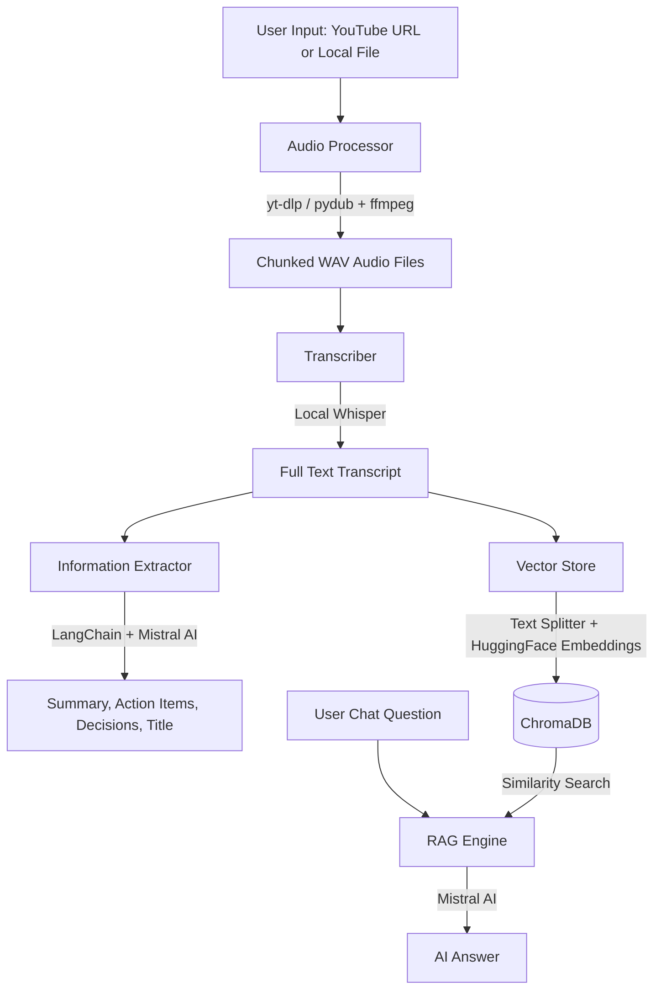

# AI Video Assistant 🎬

AI Video Assistant is a powerful Streamlit-based web application that allows you to instantly transcribe, summarize, and chat with any meeting, lecture, or video. You can provide a YouTube URL or a local audio/video file, and the application will process it to extract key insights and allow you to ask questions based on the content.

## Features

- **Multi-Source Input:** Process YouTube videos via URL or use local audio/video files.
- **Local Transcription:** Uses OpenAI's Whisper (running locally) to accurately transcribe audio into text.
- **AI Summarization:** Automatically generates a concise summary, title, action items, key decisions, and open questions using Mistral AI.
- **Interactive Chat (RAG):** Chat directly with your content. Ask questions and get answers based strictly on the meeting transcript, powered by ChromaDB and LangChain.
- **Modern UI:** A sleek, responsive, and dark-themed Streamlit interface.

## Architecture

Here is the high-level flow of how the AI Video Assistant processes data:



### Components
1. **Audio Processor (`utils/audio_processor.py`)**: Downloads YouTube audio or converts local files to WAV, then chunks the audio into manageable 10-minute segments using `ffmpeg` and `pydub`.
2. **Transcriber (`core/transcriber.py`)**: Uses local Whisper models to generate text transcripts from the audio chunks.
3. **Extractor & Summarizer (`core/extractor.py`, `core/summarizer.py`)**: Prompts Mistral AI to analyze the transcript and extract structured insights.
4. **Vector Store (`core/vector_store.py`)**: Splits the transcript into smaller pieces, creates embeddings using a HuggingFace model (`all-MiniLM-L6-v2`), and stores them in a local Chroma database.
5. **RAG Engine (`core/rag_engine.py`)**: Retrieves the most relevant parts of the transcript from ChromaDB when the user asks a question, and feeds it to Mistral AI to generate a precise answer.

## Prerequisites

- **Python 3.10+**
- **FFmpeg**: Must be installed on your system and accessible via the system PATH.
  - Windows: Download from gyan.dev or use `winget install ffmpeg`
  - macOS: `brew install ffmpeg`
  - Linux: `sudo apt install ffmpeg`

## Setup Instructions

1. **Clone the repository** (if applicable) and navigate to the project directory:
   ```bash
   cd Rag
   ```

2. **Create a virtual environment** (recommended):
   ```bash
   python -m venv .venv
   source .venv/bin/activate  # On Windows: .venv\Scripts\activate
   ```

3. **Install Python dependencies**:
   ```bash
   pip install -r requirements.txt
   ```

4. **Configure Environment Variables**:
   Copy the example environment file and add your API keys.
   ```bash
   cp .env.example .env
   ```
   1. Update your `.env` file with your Gemini API key.
2. (Optional but Recommended) Extract your YouTube `cookies.txt` using a browser extension and place it in the project root to prevent YouTube from blocking your IP.
3. Run the app:
   ```bash
   streamlit run app.py
   ```

## ☁️ Deployment (AWS EC2)

Because AI models and YouTube scraping are intensive, deploying on a dedicated virtual machine like AWS EC2 is recommended over free shared platforms.

We have included automated deployment scripts for AWS EC2.

1. **Launch an EC2 Instance:**
   - Go to the AWS Console and launch a new **Ubuntu Server** EC2 instance.
   - We recommend a `t3.medium` or larger for adequate CPU processing speed.
   - Under **Network Settings**, ensure you allow **HTTP**, **HTTPS**, and add a Custom TCP rule to allow port **8501** (Streamlit's default port).

2. **Automated Setup:**
   - When launching the instance, scroll down to **Advanced Details**.
   - In the **User data** text box at the very bottom, paste the contents of `deploy_ec2.sh`. 
   - This script will automatically install Docker, clone this repository, and launch the application.

3. **Provide Credentials (Required):**
   - Once the server is running, SSH into your instance.
   - Navigate to the project directory: `cd /home/ubuntu/video_assistant`
   - Edit the `.env` file and add your `GEMINI_API_KEY`.
   - Edit the `cookies.txt` file and paste your exported YouTube cookies. **This is mandatory on AWS**, otherwise YouTube will block the datacenter IP with a `403 Forbidden` error!
   - Restart the Docker container to apply the changes: `docker compose restart`

4. **Access the App:**
   - Open your browser and navigate to `http://<YOUR_EC2_PUBLIC_IP>:8501`

### Running with Docker (Recommended for Deployment)
If you want to run the application in an isolated container (which automatically handles system dependencies like `ffmpeg`), you can use Docker:

1. **Build the Docker image**:
   ```bash
   docker build -t ai-video-assistant .
   ```
2. **Run the container**:
   ```bash
   docker run -p 8501:8501 --env-file .env ai-video-assistant
   ```

## Deployment

For cloud deployment, please refer to the `Dockerfile` provided. Services like **Hugging Face Spaces** (using the Docker SDK) or **Render** are highly recommended due to the heavy memory requirements of PyTorch and local Whisper models. 

*(Note: Streamlit Community Cloud can be used by connecting your GitHub repo, and it will use `packages.txt` to install `ffmpeg`. However, it may encounter memory limits on the free tier).*
